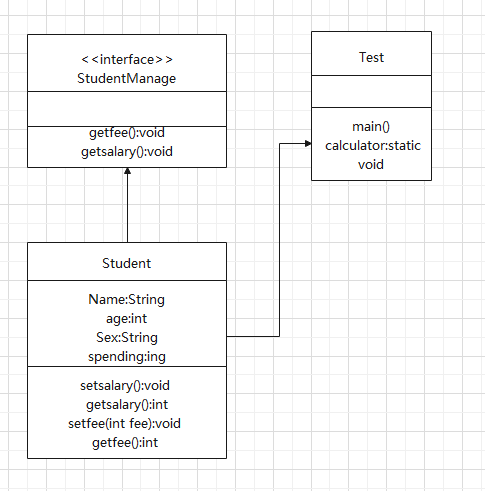
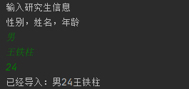
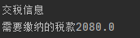
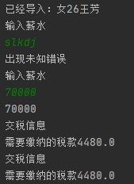

# EXperience-4
## 实验目的
* 掌握Java中抽象类和抽象方法的定义； 
* 掌握Java中接口的定义，熟练掌握接口的定义形式以及接口的实现方法
* 了解异常的使用方法，并在程序中根据输入情况做异常处理
## 实验要求
* 在博士研究生类中实现各个接口定义的抽象方法;
* 对年学费和年收入进行统计，用收入减去学费，求得纳税额；
* 国家最新纳税标准（系数），属于某一时期的特定固定值，与实例化对象没有关系，考虑如何用static  final修饰定义。
* 实例化研究生类时，可采用运行时通过main方法的参数args一次性赋值，或者交互性赋值
## 代码设计
#### 设计思路
   首先编写接口，然后用Students类实现接口。之后开始编写主方法，实现学生的实例化。加入异常处理模块，对getfee等方法进行监控。实现捕捉异常后，改写加入while循环，使出现问题时可以重新输入。最后编写计算税收的静态final方法，在主方法中调用并输出。至此实现所有实验要求。进行测试，检查功能的完整性。
#### 流程图

#### 核心代码
```
//初始化学生信息
Scanner sc = new Scanner(System.in);
//	Teacher teacher = new Teacher(args[0],args[1],age);

		int[] age = new int[5];
		String[] information = new String[10];
		System.out.println("输入研究生信息");
		System.out.println("性别，姓名，年龄");
		information[0] = sc.nextLine();
		information[1] = sc.nextLine();
		age[0] = sc.nextInt();
		sc.nextLine();
		Student li = new Student(information[0], information[1], age[0]);
```
```
//捕捉输入异常
boolean i = true;
		while (i) {
			try {
				System.out.println("输入薪水");
				int salary = 0;
				salary = sc.nextInt();
				System.out.println(salary);
				li.setsalary(salary);
				int fee = 0;
				System.out.println("输入学费");
				fee = sc.nextInt();
				System.out.println(salary);
				li.setfee(fee);
				//System.out.println(""+li.getfee());
				i = false;
			} catch (ArrayIndexOutOfBoundsException ne) {
				System.out.println("数组越界");

			} catch (NumberFormatException e) {
				System.out.println(e.getMessage() + "数字格式错误");
			} catch (Exception m) {
				System.out.println("出现未知错误");
			} finally {
				sc.nextLine();
			}
		}
		System.out.println("交税信息");
		calculator(li.getsalary(),li.getfee());
```
```
//学生管理的接口，定义学生必须要有的方法
interface StudentManage {
    void setfee(int fee);
    int getfee();
}
```
```
public final static void calculator(int salary,int fee) {
		int  year_salary = salary - fee;
		double x = 0;
		if (year_salary <= 36000) {
			x = year_salary * 0.03;
		}
		else if (36000 < year_salary && year_salary <= 144000){
			x = year_salary * 0.1 - 2520; }
               
	        ...
	
	
		else if (960000 < year_salary) {
			x = year_salary * 0.45 - 181920;
		}
		System.out.println("需要缴纳的税款" +x);
	}
```

## 实验过程问题
   在字符串判断时，“==”运算符无法对字符串的值进行判断。搜索资料，发现equals可以进行String的值的比较（原因是，String对equals进行重写，使之进行值的比较，在其他数据类型中，如果没有对equals进行重写，==与eauals的效果是等同的。
## 实验结果

---

---

---

---
## 实验感想

## 相关知识链接
==和equals的区别
https://blog.csdn.net/meism5/article/details/89029475?ops_request_misc=%257B%2522request%255Fid%2522%253A%2522160476343019725266963449%2522%252C%2522scm%2522%253A%252220140713.130102334..%2522%257D&request_id=160476343019725266963449&biz_id=0&utm_medium=distribute.pc_search_result.none-task-blog-2~all~top_click~default-1-89029475.first_rank_ecpm_v3_pc_rank_v2&utm_term=equals%E5%92%8C%3D%3D%E7%9A%84%E5%8C%BA%E5%88%AB&spm=1018.2118.3001.4449
